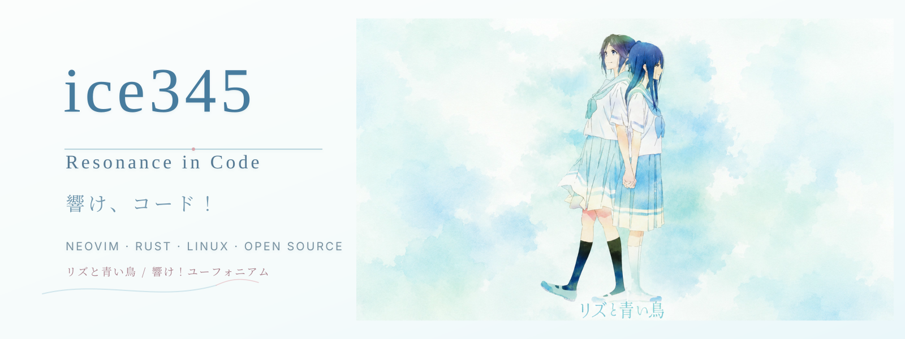
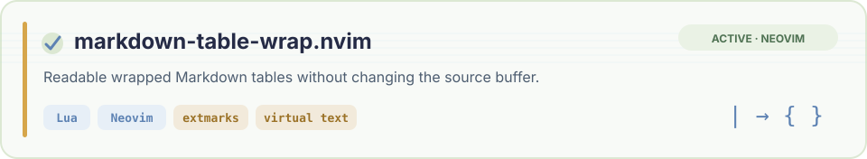
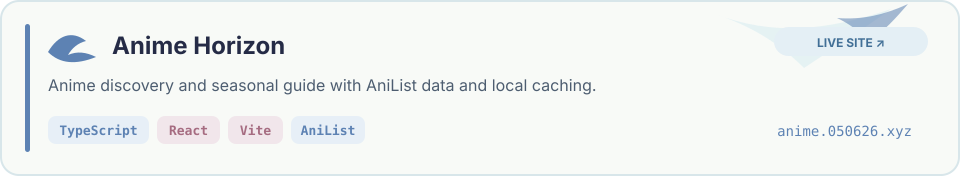
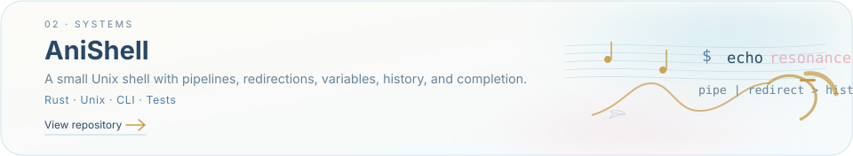
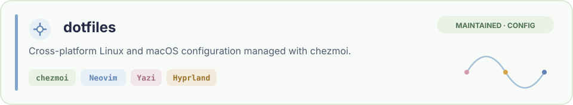

  <picture>
    <source
      media="(prefers-color-scheme: dark)"
      srcset="./assets/resonance-banner-dark.svg"
    />
    <source
      media="(prefers-color-scheme: light)"
      srcset="./assets/resonance-banner-light.svg"
    />
    
  </picture>

<strong>Systems programming · Neovim · Open source · Anime discovery</strong>

  
  
  
  

## About Me

Hi, I'm **ice345**. I build small tools around Neovim, systems programming, and anime discovery.

I work mainly with Rust, Lua, and TypeScript, and I am currently exploring the Linux kernel, eBPF fundamentals, operating systems, and open-source collaboration. I enjoy learning through issues, reviews, pull requests, and projects that turn curiosity into something useful.

Away from the terminal, I enjoy Japanese animation and music—especially *響け！ユーフォニアム* and *リズと青い鳥*.

## Current Movement · 現在の楽章

- **Linux kernel and eBPF fundamentals** — learning how systems behave beneath user space.
- **Rust systems programming** — exploring ownership, concurrency, processes, and command-line tools.
- **Neovim and Lua plugin development** — building editor-native interfaces for everyday writing workflows.
- **Open-source collaboration** — practicing issue discussion, review, pull requests, documentation, and releases.
- **Anime discovery and recommendation tools** — working with seasonal data, local caching, and recommendation experiments.

## Featured Projects

<a href="https://github.com/ice345/markdown-table-wrap.nvim">
  <picture>
    <source media="(prefers-color-scheme: dark)" srcset="./assets/projects/markdown-table-wrap-dark.svg" />
    <source media="(prefers-color-scheme: light)" srcset="./assets/projects/markdown-table-wrap-light.svg" />
    
  </picture>
</a>

<a href="https://anime.050626.xyz/">
  <picture>
    <source media="(prefers-color-scheme: dark)" srcset="./assets/projects/anime-horizon-dark.svg" />
    <source media="(prefers-color-scheme: light)" srcset="./assets/projects/anime-horizon-light.svg" />
    
  </picture>
</a>

<a href="https://github.com/ice345/anishell">
  <picture>
    <source media="(prefers-color-scheme: dark)" srcset="./assets/projects/anishell-dark.svg" />
    <source media="(prefers-color-scheme: light)" srcset="./assets/projects/anishell-light.svg" />
    
  </picture>
</a>

<a href="https://github.com/ice345/dotfiles">
  <picture>
    <source media="(prefers-color-scheme: dark)" srcset="./assets/projects/dotfiles-dark.svg" />
    <source media="(prefers-color-scheme: light)" srcset="./assets/projects/dotfiles-light.svg" />
    
  </picture>
</a>

Anime Horizon opens the live site · <a href="https://github.com/ice345/Anime-horizon_pro">source repository</a>

## Languages & Tools

  
<strong>Languages · used and learning</strong>

  <picture>
    <source
      media="(prefers-color-scheme: dark)"
      srcset="https://skillicons.dev/icons?i=rust%2Clua%2Cts%2Cjs%2Cpy%2Cc%2Cocaml%2Cgo%2Cbash%2Cmd&amp;theme=dark&amp;perline=10"
    />
    <source
      media="(prefers-color-scheme: light)"
      srcset="https://skillicons.dev/icons?i=rust%2Clua%2Cts%2Cjs%2Cpy%2Cc%2Cocaml%2Cgo%2Cbash%2Cmd&amp;theme=light&amp;perline=10"
    />
    
  </picture>

  
<strong>Web · runtime</strong>

  <picture>
    <source
      media="(prefers-color-scheme: dark)"
      srcset="https://skillicons.dev/icons?i=react%2Cvite%2Cnodejs%2Chtml%2Ccss&amp;theme=dark&amp;perline=5"
    />
    <source
      media="(prefers-color-scheme: light)"
      srcset="https://skillicons.dev/icons?i=react%2Cvite%2Cnodejs%2Chtml%2Ccss&amp;theme=light&amp;perline=5"
    />
    
  </picture>

  
<strong>Environment · workflow</strong>

  <picture>
    <source
      media="(prefers-color-scheme: dark)"
      srcset="https://skillicons.dev/icons?i=linux%2Carch%2Capple%2Cneovim%2Cvscode%2Cgit%2Cgithub%2Cgithubactions%2Cdocker&amp;theme=dark&amp;perline=9"
    />
    <source
      media="(prefers-color-scheme: light)"
      srcset="https://skillicons.dev/icons?i=linux%2Carch%2Capple%2Cneovim%2Cvscode%2Cgit%2Cgithub%2Cgithubactions%2Cdocker&amp;theme=light&amp;perline=9"
    />
    
  </picture>

Current study focus: Linux kernel · eBPF · systems programming · Go · OCaml

  
  
  
  

## GitHub Activity

  <picture>
    <source
      media="(prefers-color-scheme: dark)"
      srcset="https://raw.githubusercontent.com/ice345/ice345/output/github-overview-dark.svg"
    />
    <source
      media="(prefers-color-scheme: light)"
      srcset="https://raw.githubusercontent.com/ice345/ice345/output/github-overview-light.svg"
    />
    
  </picture>

   

  <picture>
    <source
      media="(prefers-color-scheme: dark)"
      srcset="https://raw.githubusercontent.com/ice345/ice345/output/github-languages-dark.svg"
    />
    <source
      media="(prefers-color-scheme: light)"
      srcset="https://raw.githubusercontent.com/ice345/ice345/output/github-languages-light.svg"
    />
    
  </picture>

Generated daily from public GitHub data. Rolling activity covers the previous 12 months; language share describes repository files, not proficiency.

## Contribution Snake

  <picture>
    <source
      media="(prefers-color-scheme: dark)"
      srcset="https://raw.githubusercontent.com/ice345/ice345/output/github-snake-dark.svg"
    />
    <source
      media="(prefers-color-scheme: light)"
      srcset="https://raw.githubusercontent.com/ice345/ice345/output/github-snake-light.svg"
    />
    
  </picture>

Generated daily on the dedicated <code>output</code> branch.

## Favorite Works

- 響け！ユーフォニアム
- リズと青い鳥
- やはり俺の青春ラブコメはまちがっている
- 青春ブタ野郎
- 古典部
- カタオモイ
- 願い〜あの頃のキミへ〜
- NIGHT DANCE
- Anytime Anywhere
- クズり念

Finding resonance between anime, music, systems, and code.

小さな一歩を、確かな響きへ。

